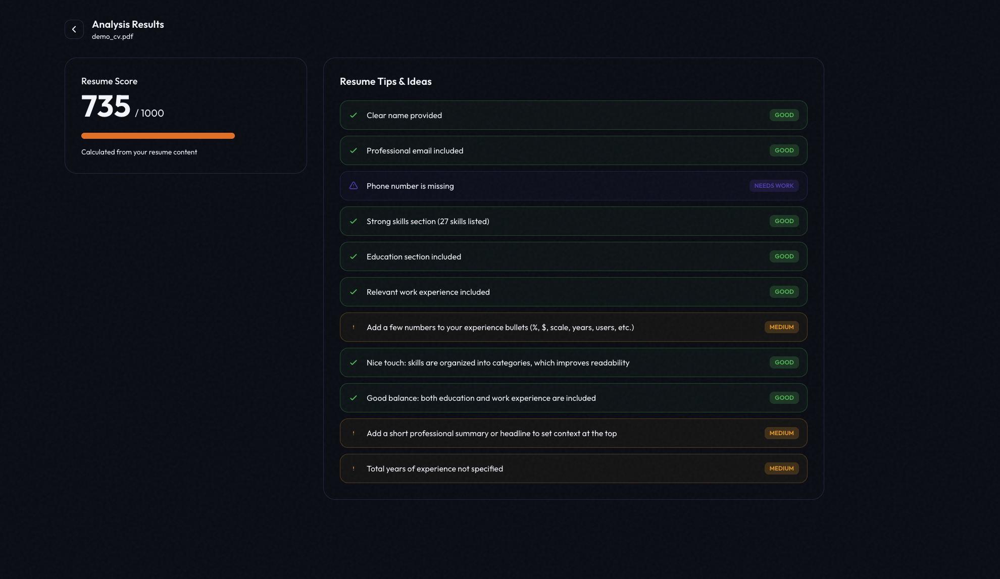

# ResumeAI

ResumeAI analyzes resumes and returns a **score and actionable improvement tips**.
The frontend is built with **React (Vite)** and the **API** is a **FastAPI** server that can:

- **Parse resume files** via `/parse` (deterministic scoring from extracted fields)
- **Run LLM-based matching** between resume + job description via `/analyze` (prompt → model → validated JSON)

## UI

- **Landing page**: 
- **Result page**: 

## Architecture

### Frontend

- Uploads a resume (PDF/DOCX) to the API (`POST /parse`)  
- Displays the **score** and **tips** on the result view

### API + backend domain logic

There are two main flows:

- **`POST /parse`**: accepts a file (multipart), extracts text and normalizes fields → computes **score + tips deterministically**
- **`POST /analyze`**: accepts `cv_text` + `job_text`, builds a prompt, calls **Ollama** and requires the model to return **pure JSON** following a schema

## Scoring

`/parse` returns a deterministic **score (0–1000)** plus improvement tips from normalized resume fields

- **Core checks**: contact info, skills coverage, education, work experience, total experience and length (pages)
- **Quality heuristics**: quantified impact in experience, skills grouping vs flat list, education↔experience balance and summary/headline presence
- **Tip severities**: `GOOD` (keep), `WARNING` (improve), `NEEDS_WORK` (missing/critical)

## API: prompt → model → validation pipeline (`/analyze`)

Pipeline at a glance:
- The backend LLM service builds a prompt that forces the model to respond with **valid JSON**: `score (0–1000)`, `tips[]` and optional `analysis`.
- The API calls Ollama at `POST /api/generate` with `model` from `OLLAMA_MODEL`.
- The response is **parsed as JSON** and validated (score range, tip shape). If output is invalid, the API returns an error (`INVALID_MODEL_OUTPUT`).

## Model training

This is the setup used for the model in this project:

- **Data**: **synthetically generated data** (synthetic resumes + job descriptions + labels/tips) to iterate quickly without personal data
- **Training**: **Google Colab** (GPU)
- **Fine-tuning**: **Unsloth**
- **Base model** (starting point):

```python
model_name = "unsloth/Phi-3-mini-4k-instruct-bnb-4bit"
```

After training, the model can be exported and run locally via **Ollama**

> Note: In the codebase, the model is selected by `OLLAMA_MODEL`

## Docker / Compose

Everything runs in containers via Docker Compose:

- **`ollama`**: runs the model (persistent volume)
- **`api`**: Talks to `ollama` over the internal Docker network
- **`client`**: Vite dev server

Start everything:

```bash
docker compose up --build
```

Endpoints:

- **API**: `http://localhost:8000`
- **Ollama**: `http://localhost:11434`
- **Client**: `http://localhost:5173`


## File formats

- **`/parse`** effectively supports **PDF + DOCX** (text extraction via `pdfminer` and `python-docx`).
